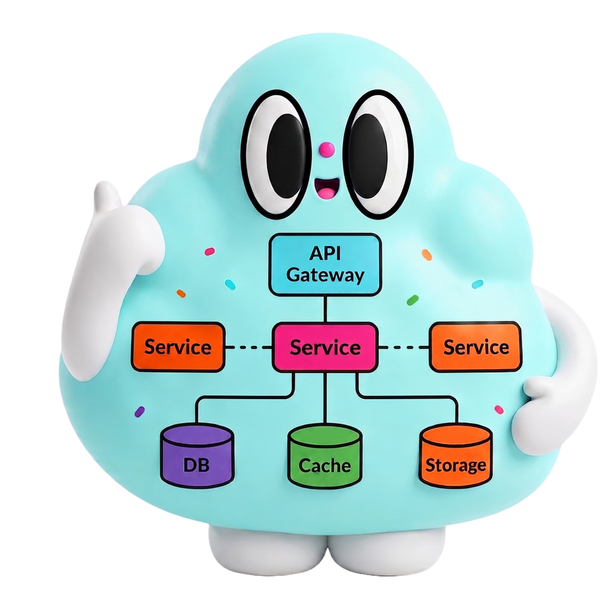
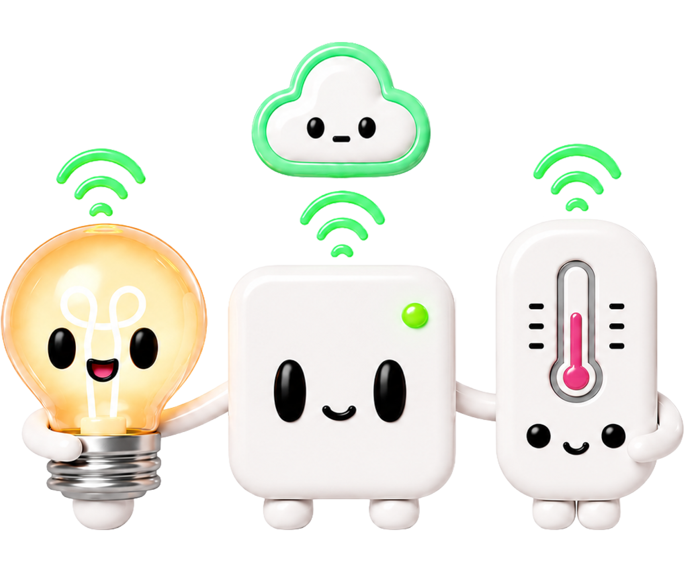
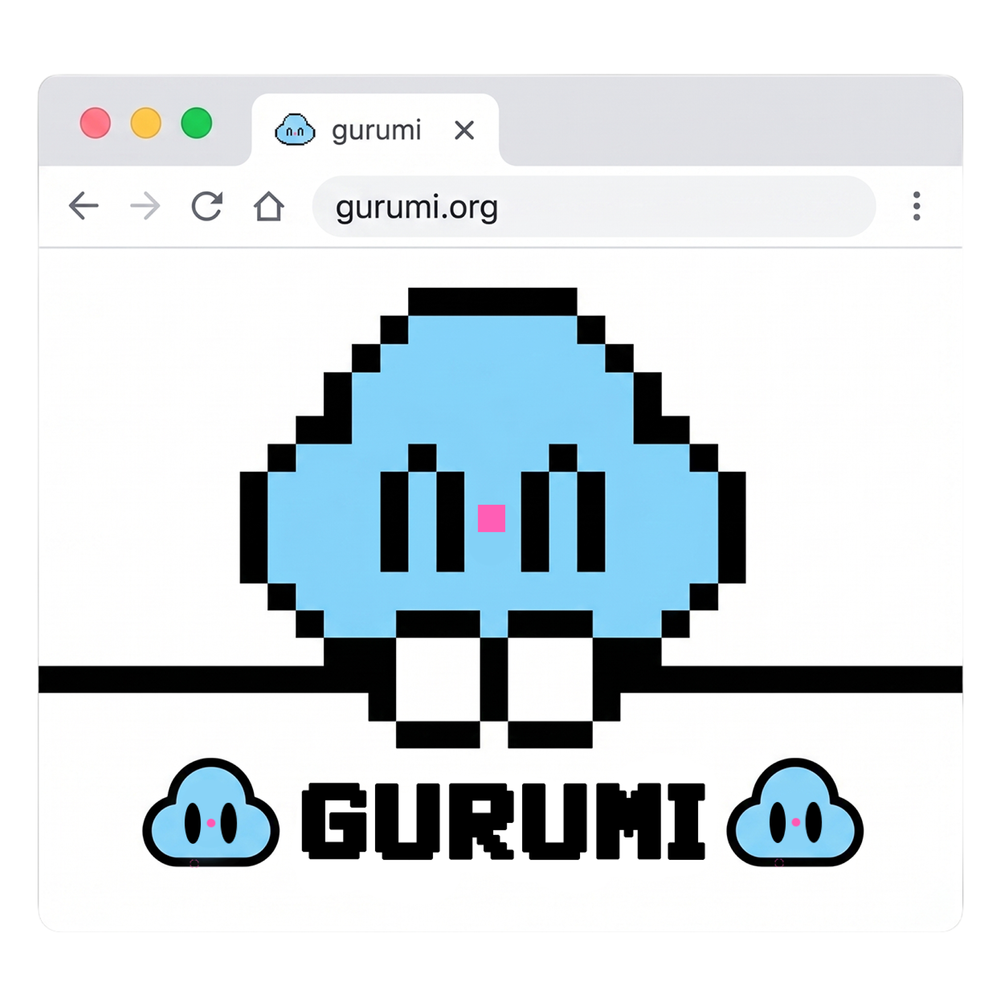
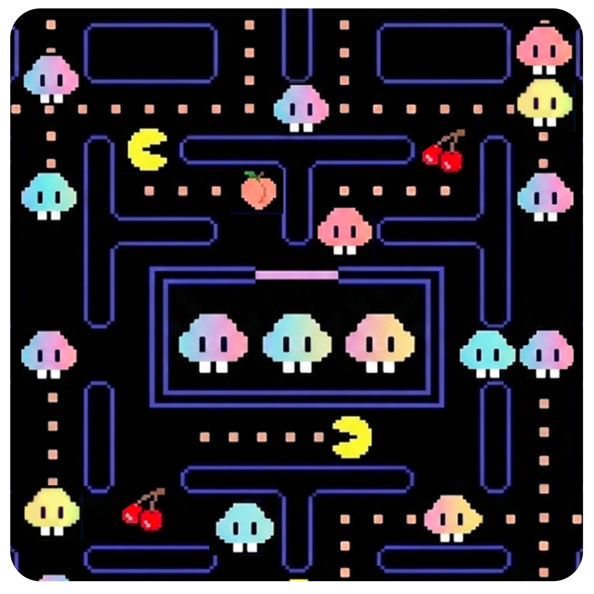

# 2026 Seoul Summit Digital Assets

이 디렉토리는 2026 AWS KRUG Seoul Summit 관련 디지털 자산을 보관합니다.

## 폴더 구성

| 폴더 | 설명 |
| ---- | ---- |
| [`png/`](png/) | 웹/문서 삽입용 PNG 미리보기 이미지 |
| [`pdf/`](pdf/) | 인쇄/배포용 PDF (전체 스티커 모음집 `Seoul_Summit_2026.pdf` 포함) |
| [`ai/`](ai/) | Adobe Illustrator 원본 파일 (편집용) |

## 이미지 프리뷰

아래는 `png/` 폴더에 포함된 스티커 디자인 미리보기입니다.

| 파일명 | 미리보기 |
| ------ | -------- |
| Architecture.png |  |
| DevOps.png |  |
| IOT.png |  |
| ausg.png |  |
| beginner.png |  |
| busan.png |  |
| certified.png |  |
| container.png |  |
| data.png |  |
| euljiro.png |  |
| frontend.png |  |
| gametech_without-title.png |  |
| guro.png |  |
| inchun.png |  |
| kiro-and-grumi-love.png |  |
| kiro-ghost-gurumi.png |  |
| kiro-sticker.png |  |
| magok.png |  |
| plateform.png |  |
| security.png |  |
| severless.png |  |
| women-in-cloud.png |  |

> 전체 파일 미리보기는 브라우저에서 확인하세요. 인쇄용 PDF·원본 AI는 동일한 파일명 기준으로 `pdf/`, `ai/` 폴더에서 확인할 수 있습니다.
