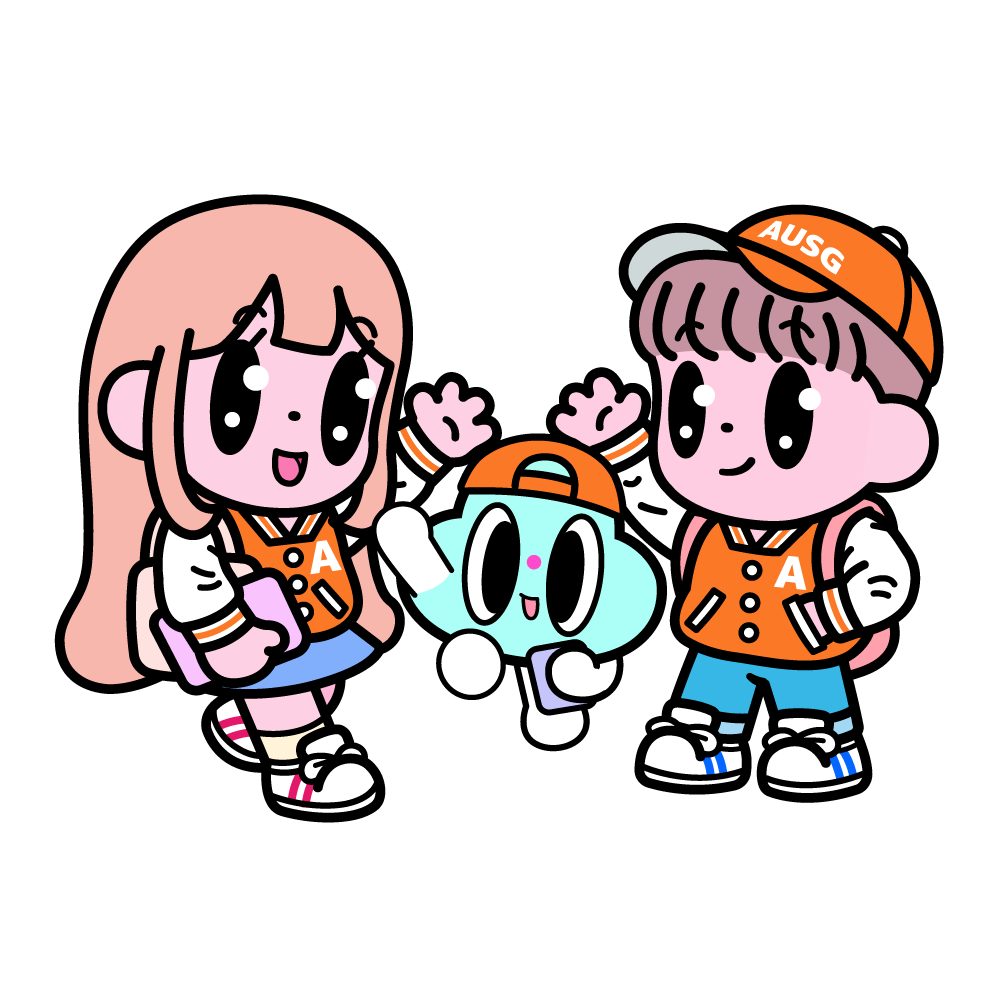
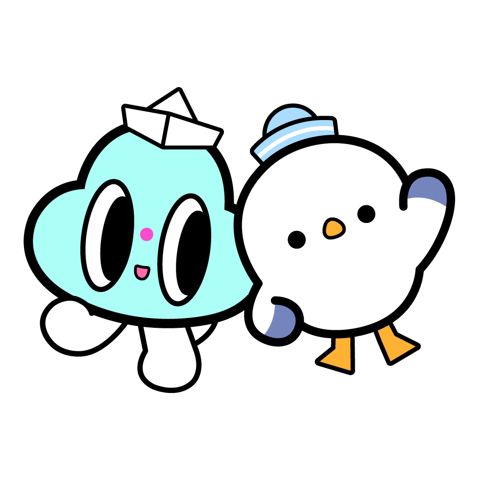
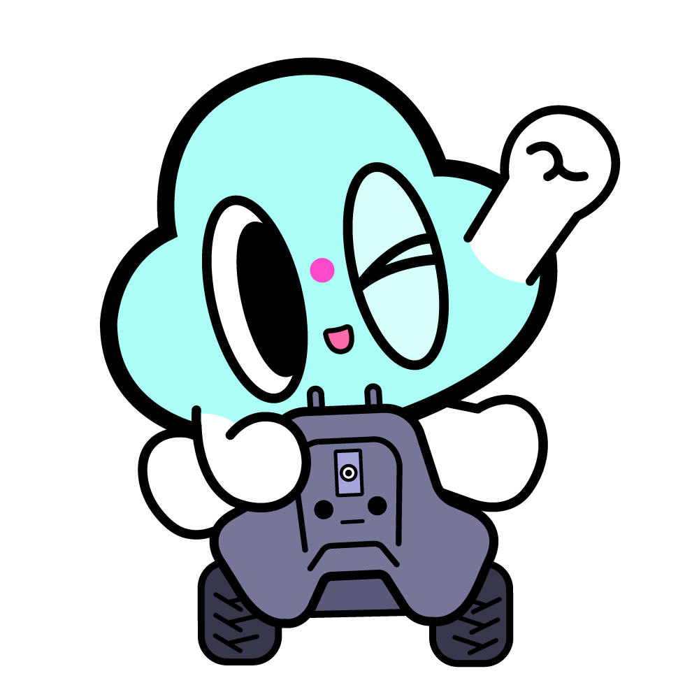
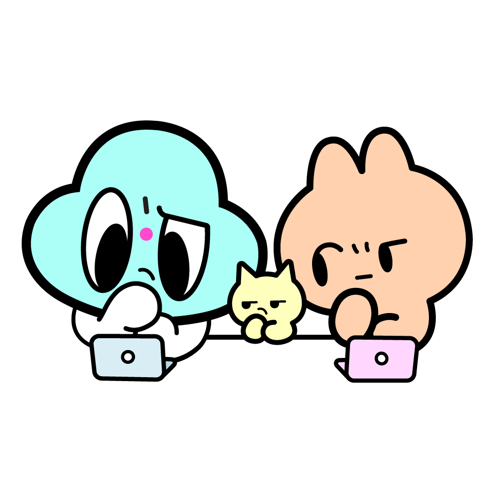
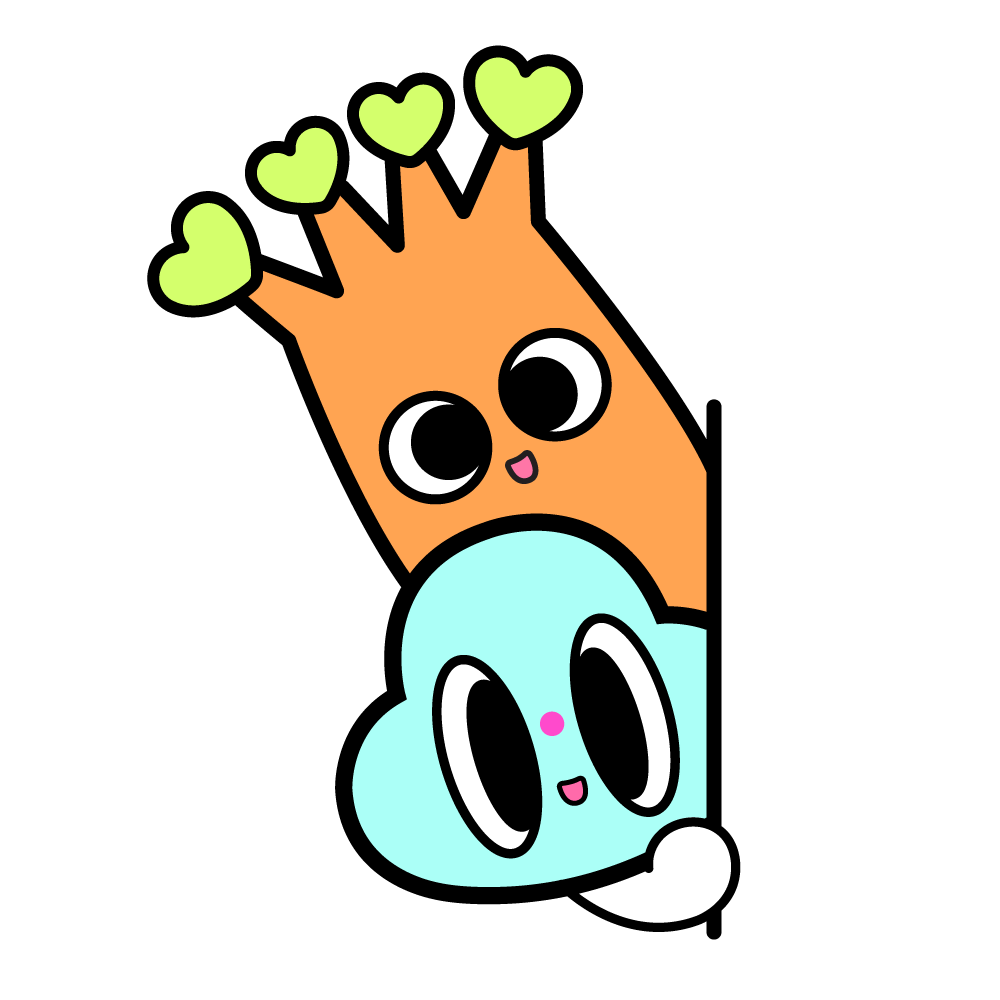

# AWSKRUG Digital Assets
이곳은 AWS 한국 유저그룹(AWSKRUG)의 디지털 자산을 보관하는 저장소입니다.

> 별도로 명시된 경우를 제외하고 이 페이지의 컨텐츠는 [Creative Commons Attribution 3.0 License](https://creativecommons.org/licenses/by/3.0/)로 라이센스가 부여되며 코드 샘플은 [Apache 2.0 License](https://www.apache.org/licenses/LICENSE-2.0)에 의거하여 라이센스가 부여됩니다.

## 이미지 갤러리

### 커뮤니티 로고
| 로고 | 모임 |
|---------|------|
|  | [AI Engineering](ai%20engineering/ai-engineering.png) |
|  | [Architecture](architecture/architecture.png) |
|  | [AUSG](ausg/ausg.png) |
|  | [Beginners](beginners/beginners.png) |
|  | [Busan](busan/busan.png) |
|  | [Certification](cert/cert.png) |
|  | [Container](containter/container.png) |
|  | [Data](data/data.png) |
|  | [DeepRacer](deepracer/deepracer.png) |
|  | [DevOps](devops/devops.png) |
|  | [Euljiro](euljiro/euljiro.png) |
|  | [GameTech](gametech/gametech.png) |
|  | [Gudi](gudi/gudi.png) |
|  | [Gurumi](gurumi/gurumi.png) |
|  | [Hands-on](handson/handson.png) |
|  | [iOS](ios/ios.png) |
|  | [IoT](iot/iot.png) |
|  | [Magok](magok/magok.png) |
|  | [Network](network/network.png) |
|  | [Pangyo](pangyo/pangyo.png) |

### 특별 이벤트
| 미리보기 | 이벤트명 |
|---------|------|
|  | [2024 Community Day Mug](2024%20community%20day%20/mug/mug_mock%20up.png) |
|  | [2022 Happy New Year](legacy/2022HappyNewYear/2022happynewyear.png) |
|  | [2023 Greeting](legacy/2023-greeting-aws.png) |

### 레거시 이미지
| 미리보기 | 경로 |
|---------|------|
|  | [DeepRacer Evolution Gurumi](legacy/DEEPRACER/deepracer_evo_gurumi.png) |
|  | [Gurumi DeepRacer](legacy/DEEPRACER/gurumi%20deepracer.png) |
|  | [Legacy DevOps](legacy/DevOps/AWSKRUG-DevOps.png) |
|  | [Golang Gurumi](legacy/GOLANG/gurumi-with-gopher_banner.png) |
|  | [Gurumi v2](legacy/gurumi-v2.png) |
|  | [Security](legacy/security/security.png) |
